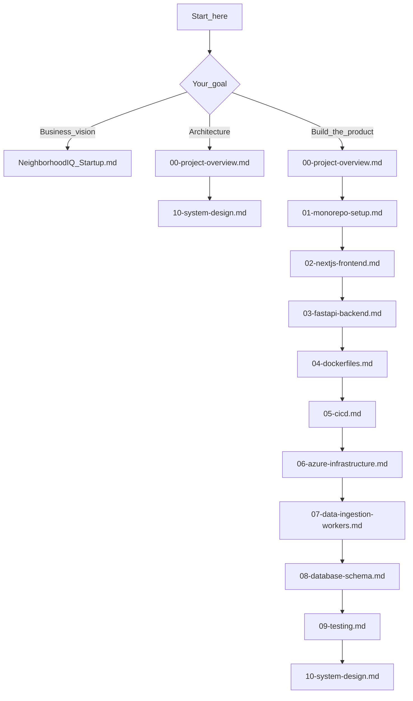

# NeighborhoodIQ Design Specs

NeighborhoodIQ is an AI-powered neighborhood intelligence platform that produces a comprehensive **Neighborhood Score** for any U.S. address — covering healthcare access, safety, environment, education, and economic health, with plain-English AI narratives.

This repository stores **design specifications and implementation playbooks only**. It does not contain application code. The specs describe a future monorepo (`apps/`, `workers/`, `infra/`) that will be built from these documents.

---

## How to Read This Documentation

Choose a path based on your goal. Each document links to the next in sequence so you can read cover to cover like a book.

### Path A — Business & Vision

For investors, co-founders, and non-technical readers who want to understand the problem, market, and go-to-market strategy.

1. [NeighborhoodIQ — Startup Brief](./NeighborhoodIQ_Startup.md)

### Path B — Technical Blueprint

For architects and senior engineers who need the locked stack, conventions, and deep system design.

1. [00 — Project Overview](./00-project-overview.md) — locked architecture decisions, repo layout, conventions
2. [10 — System Design](./10-system-design.md) — data flows, scaling, security, failure modes

### Path C — Full Build Sequence

For implementation — read end to end when scaffolding the product.

1. [NeighborhoodIQ — Startup Brief](./NeighborhoodIQ_Startup.md) *(optional context)*
2. [00 — Project Overview](./00-project-overview.md)
3. [10 — System Design](./10-system-design.md)
4. [01 — Monorepo Setup](./01-monorepo-setup.md) through [09 — Testing](./09-testing.md) **in order**

---

## Document Index

| # | Document | Summary |
|---|----------|---------|
| — | [NeighborhoodIQ — Startup Brief](./NeighborhoodIQ_Startup.md) | Problem, solution, market size, competitive landscape, GTM, vision |
| 00 | [Project Overview](./00-project-overview.md) | Locked stack, repo layout, env vars, conventions, build status |
| 01 | [Monorepo Setup](./01-monorepo-setup.md) | Scaffold repo, `.env`, docker-compose local dev |
| 02 | [Next.js Frontend](./02-nextjs-frontend.md) | App Router UI, Auth.js, Mapbox, Tailwind |
| 03 | [FastAPI Backend](./03-fastapi-backend.md) | Layered API, services, Claude integration |
| 04 | [Dockerfiles](./04-dockerfiles.md) | Multi-stage images for web, api, and workers |
| 05 | [CI/CD Pipeline](./05-cicd.md) | GitHub Actions build, test, and deploy |
| 06 | [Azure Infrastructure](./06-azure-infrastructure.md) | Container Apps, PostGIS, Key Vault, Bicep |
| 07 | [Data Ingestion Workers](./07-data-ingestion-workers.md) | Scheduled federal data pipelines (CMS, EPA, FEMA, FBI, etc.) |
| 08 | [Database Schema](./08-database-schema.md) | PostGIS tables, Alembic migrations, ORM models |
| 09 | [Testing](./09-testing.md) | pytest backend and frontend test strategy |
| 10 | [System Design](./10-system-design.md) | Authoritative architecture — data flows, caching, security, scaling |

---

## For AI-Assisted Development

Documents `00` through `10` include **Claude instructions** — ordered command blocks meant to be executed step by step when building the monorepo. Recommended agent workflow:

1. Read [00 — Project Overview](./00-project-overview.md) for locked decisions (do not propose alternatives unless asked).
2. Consult [10 — System Design](./10-system-design.md) before any structural changes.
3. Execute [01](./01-monorepo-setup.md) through [09](./09-testing.md) sequentially when scaffolding the codebase.

---

## Project Status

Pre-implementation — all milestones pending:

- [ ] Monorepo scaffold
- [ ] Docker local dev stack
- [ ] FastAPI skeleton with health check
- [ ] Next.js skeleton with address search UI
- [ ] PostgreSQL + PostGIS schema
- [ ] First ingestion worker (EPA AQI)
- [ ] Scoring pipeline v1
- [ ] Claude narrative generation
- [ ] Auth (Next Auth / Auth.js)
- [ ] Freemium gating middleware
- [ ] PDF export
- [ ] CI/CD pipeline
- [ ] Azure infrastructure (Bicep)

---

## Contributing

Private startup design specs. Not licensed for public reuse.
